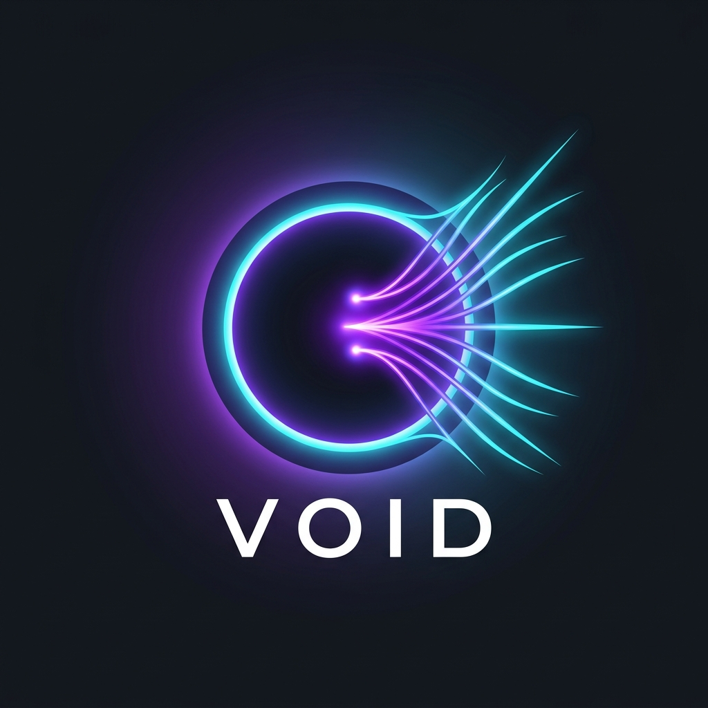

  
  

   

  **Start from Void. Build without limits.**
  
  
  
  
  
  

---

## 📖 What is Void?

Void is an **open-source, GitHub-native community** where ideas are shared, validated, and built — together. No gatekeepers. No paywalls. No scams. Just real people collaborating on real ideas using the tools developers already know and trust: **Issues, Discussions, and Pull Requests.**

Everything starts from nothing. Every great product, every world-changing project — they all began as a spark in someone's mind. **Void is where that spark finds its fire.**

---

## 🔭 The Vision

> *"Everyone has ideas. But most of them die in silence."*

Here's the problem today:

🚫 **Ideas stay trapped** — People have brilliant ideas but never share them publicly. They sit in private notes, never validated, never challenged, never improved.

🚫 **No public validation** — There's no easy, open space to put your raw idea out there and get honest, constructive feedback from a diverse community.

🚫 **Can't find the right people** — You have an idea but not the skills to build it. Or you have skills but no idea worth building. The right people never connect.

🚫 **Scams & closed ecosystems** — Platforms that promise collaboration often hide behind paywalls, harvest your data, or are breeding grounds for bad actors.

### 💡 So we built Void.

An **open-source repository where every idea matters.** No matter how big or small, polished or raw — if you have an idea, this is the place to share it. The community will help you validate it, refine it, and if it's worth building — **we build it together.**

| The Old Way | The Void Way |
|:---|:---|
| 💭 Ideas stay in your head | 💡 Ideas are shared publicly |
| 🔒 Closed groups, no transparency | 🌍 Open-source, fully transparent |
| 🤷 No feedback, no validation | 💬 Community discusses & refines |
| 😔 Can't find collaborators | 🤝 Right people find the right ideas |
| 💸 Paid platforms & scams | ❤️ Free, open, and trustworthy |

> **Our mission is simple:** Make it ridiculously easy for anyone to share an idea, find the right people, and build something meaningful — all in the open.

---

## 🔄 How It Works

  <h3>
    💡 Submit Idea &nbsp; ➡️ &nbsp; 💬 Discuss &nbsp; ➡️ &nbsp; 🛠️ Build &nbsp; ➡️ &nbsp; 🚀 Ship
  </h3>

## 🚀 Quick Start

| Action | Description | Link |
| :---: | :--- | :--- |
| **💡 Propose Idea** | Have a spark? Share your idea in Discussions. | [Propose an Idea](../../discussions/new?category=ideas) |
| **💬 Discuss & Vote** | Join discussions, vote with 👍 (+1), and evaluate ideas. | [Join Discussions](../../discussions) |
| **🔍 Browse Tasks** | Explore technical tasks and bugs ready to build. | [Browse Issues](../../issues) |
| **🛠️ Build** | Ready to code? Help implement an approved idea. | [Contribute](./CONTRIBUTING.md) |

## ✨ Features

- **💡 Discussions-Only Ideation:** Ideas live exclusively in GitHub Discussions (`💡 Ideas`) to avoid Issue naming conflicts.
- **💬 Potential-First Evaluation:** Threaded conversations and 👍 (+1) upvotes to validate an idea's potential before building.
- **🛠️ Open Implementation:** Anyone can claim a validated task and start building it.
- **🏷️ Clear Tracking:** Monitor the progress of ideas from proposal to shipping.
- **❤️ Community-Driven:** Built by the community, for the community.

## 🧬 Idea Lifecycle

Every idea on Void goes through a structured lifecycle to ensure quality and collaborative refinement:

1. **New:** 💡 Freshly submitted ideas awaiting review.
2. **Under Discussion:** 💬 The community is actively brainstorming and providing feedback.
3. **Approved:** ✅ The idea is solid and ready for implementation.
4. **In Progress:** 🛠️ A contributor has claimed the idea and is actively building it.
5. **Completed:** 🚀 The project is finished and shipped!

For a detailed breakdown of the lifecycle and labels, please read the [Idea Lifecycle Document](./docs/IDEA_LIFECYCLE.md).

## 🤝 Community

Void thrives on community participation! Whether you're an idea generator, a constructive critic, or a builder, there's a place for you here.

- Join our [Discussions](../../discussions) to introduce yourself.
- Read our [Code of Conduct](./CODE_OF_CONDUCT.md) to understand our community standards.

## 🛠️ Contributing

We welcome contributions of all kinds! Please read our [Contributing Guidelines](./CONTRIBUTING.md) to learn how you can get involved, whether by submitting ideas, participating in discussions, or writing code.

## 📄 License

This project is licensed under the MIT License - see the [LICENSE](./LICENSE) file for details.

---

  <i>Start from Void. Build without limits. 🚀</i>
    
  An <a href="https://github.com/Idea-Verse">Idea-Verse</a> project

