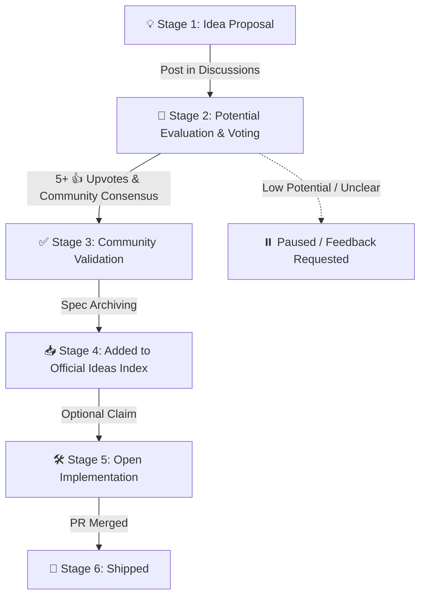

# The Potential-First Idea Lifecycle

This document explains the lifecycle of an idea submitted to **Void**. 

In Void, **Ideas live EXCLUSIVELY in GitHub Discussions (`💡 Ideas`)**. Issues are strictly reserved for bug reports and implementation tasks. This avoids any naming conflicts and keeps ideation clean, open, and focused on potential.

---

## 🧬 Lifecycle Flow

---

## 🏷️ Stages & Governance Rules

### 💡 Stage 1: Idea Proposal (Discussions ONLY)
- **Where:** GitHub **Discussions** (`💡 Ideas` category).
- **Rule:** All ideas **must** be submitted in Discussions (not Issues). This prevents clutter and naming conflicts in the Issue tracker.
- **Requirement:** Must include a Problem Statement, Proposed Solution, and Target Audience.

### 💬 Stage 2: Potential Evaluation & 🗳️ Community Voting
- **Where:** GitHub **Discussions**.
- **Goal:** Debate potential, market fit, and feasibility.
- **Rule:** Community members vote using **👍 (+1) reactions** or **🗳️ Polls**. 

### ✅ Stage 3: Community Validation (Approval Threshold)
- **Criteria:**
  1. Minimum **5+ 👍 Upvotes** from community members in Discussions.
  2. Active discussion refining the scope and solving obvious flaws.
  3. Maintainer review confirming uniqueness and high potential.
- **Marked as:** `Answered` / `Validated` in Discussions.

### 📥 Stage 4: Added to Official Ideas Index
- **Where:** `ideas/` directory in the repository.
- **Goal:** The validated spec is officially archived as an approved project idea.

### 🛠️ Stage 5: Open Implementation
- **Where:** GitHub **Issues** & Pull Requests.
- **Rule:** Once an idea is validated in Discussions, an Issue is created for developers to claim and build it.
- **Claim Rule:** 14-Day Activity Rule applies. Inactive claims expire after 14 days.

### 🚀 Stage 6: Shipped
- **Goal:** PR reviewed, approved, and merged into the target codebase.

---

## 🛡️ Core Rules Summary

1. **Discussions Only for Ideas:** Issues are for bugs & tasks; Discussions are for ideas & voting.
2. **Potential First:** Ideas must be evaluated in Discussions before approval.
3. **5-Upvote Threshold:** At least 5 community upvotes in Discussions required for validation.
4. **14-Day Claim Limit:** Inactive claims expire after 14 days.
5. **100% Open Source:** No paywalls, crypto scams, or locked specs.
