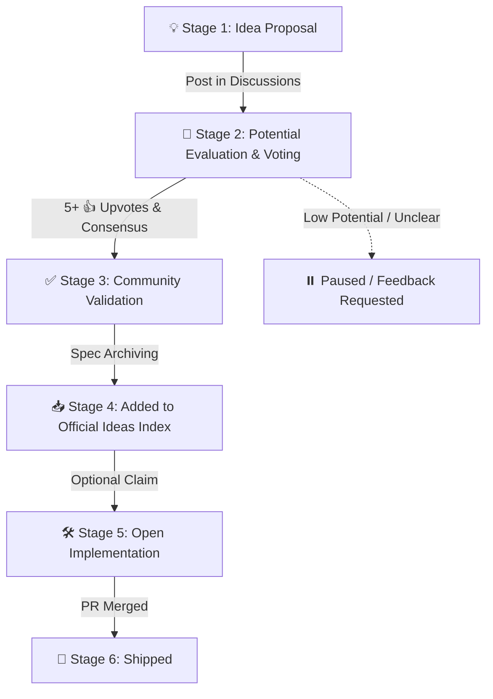

# The Potential-First Idea Lifecycle

This document explains the lifecycle of an idea submitted to **Void**. 

At Void, **Discussion of Potential Comes First**. We focus on discovering, evaluating, and refining great ideas through community discussion *before* any code or official idea spec is approved.

---

## 🧬 Lifecycle Flow

---

## 🏷️ Stages & Governance Rules

### 💡 Stage 1: Idea Proposal
- **Where:** GitHub **Discussions** (`💡 Ideas` category) or standard Issue template.
- **Goal:** Share a raw or structured idea.
- **Rule:** Anyone can submit an idea, but it must include a Problem Statement, Proposed Solution, and Target Audience.

### 💬 Stage 2: Potential Evaluation & 🗳️ Community Voting
- **Where:** GitHub **Discussions** & **Issues**.
- **Goal:** Debate potential, market fit, feasibility, and refine the spec.
- **Rule:** Community members vote using **👍 (+1) reactions** or **🗳️ Polls**. 

### ✅ Stage 3: Community Validation (Approval Threshold)
- **Criteria:**
  1. Minimum **5+ 👍 Upvotes** from community members.
  2. Active discussion refining the scope and solving obvious flaws.
  3. Maintainer review confirming uniqueness and high potential.
- **Label:** `idea: approved`

### 📥 Stage 4: Added to Official Ideas Index
- **Where:** `ideas/` directory in the repository.
- **Goal:** The validated spec is officially archived as an approved project idea for anyone in the open-source world to reference.

### 🛠️ Stage 5: Open Implementation
- **Where:** Feature branch & Pull Request.
- **Rule:** 14-Day Activity Rule applies. If a builder claims an approved idea but remains inactive for 14 days, the issue is unassigned for others.

### 🚀 Stage 6: Shipped
- **Goal:** PR reviewed, approved, and merged into the target codebase.
- **Label:** `idea: completed`

---

## 🛡️ Core Rules Summary

1. **Potential First:** Ideas must be evaluated in Discussion before approval.
2. **5-Upvote Threshold:** At least 5 community upvotes required for validation.
3. **14-Day Claim Limit:** Inactive claims expire after 14 days.
4. **100% Open Source:** No paywalls, crypto scams, or locked specs.
