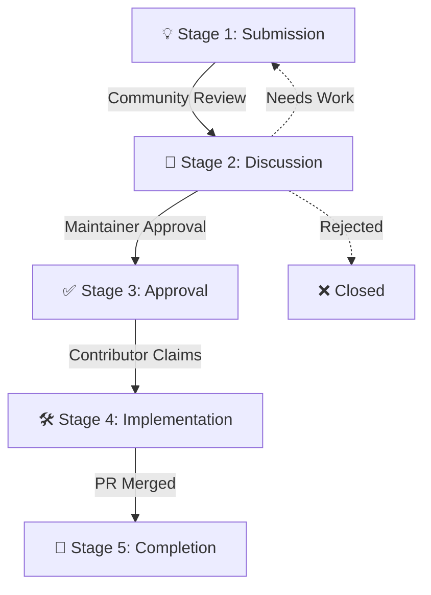

# The Idea Lifecycle

This document explains the lifecycle of an idea submitted to Void. Every idea goes through several stages to ensure it is properly evaluated, discussed, and implemented.

## 🧬 Lifecycle Flow

## 🏷️ Stages and Labels

### 💡 Stage 1: Submission
- **What happens:** A community member submits an idea using the [Idea Submission Issue Template](../../issues/new?template=idea_submission.yml).
- **Label:** `status: new`
- **Action Required:** Maintainers perform an initial triage to ensure the submission is complete and not a duplicate.

### 💬 Stage 2: Discussion
- **What happens:** The idea is open for community discussion. Members provide feedback, suggest improvements, and discuss feasibility.
- **Label:** `status: under discussion`
- **Action Required:** The author and the community work together to refine the idea until a consensus is reached on the scope and design.

### ✅ Stage 3: Approval
- **What happens:** Maintainers review the finalized idea and approve it for development.
- **Label:** `status: approved` (replaces previous status labels)
- **Action Required:** The idea is now ready to be claimed by a contributor.

### 🛠️ Stage 4: Implementation
- **What happens:** A contributor claims the idea by commenting on the issue. They are assigned the issue and begin working on a Pull Request.
- **Label:** `status: in progress` (replaces `approved`)
- **Action Required:** The contributor implements the code, tests it, and submits a PR linking back to the issue.

### 🚀 Stage 5: Completion
- **What happens:** The Pull Request is reviewed, approved, and merged into the main codebase.
- **Label:** `status: completed`
- **Action Required:** The issue is closed, and the community celebrates a successful new addition!
